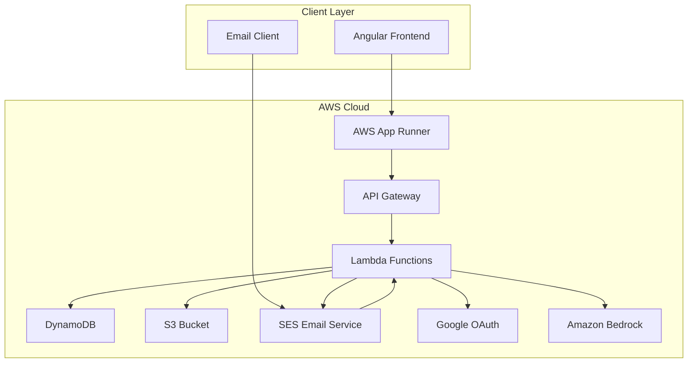
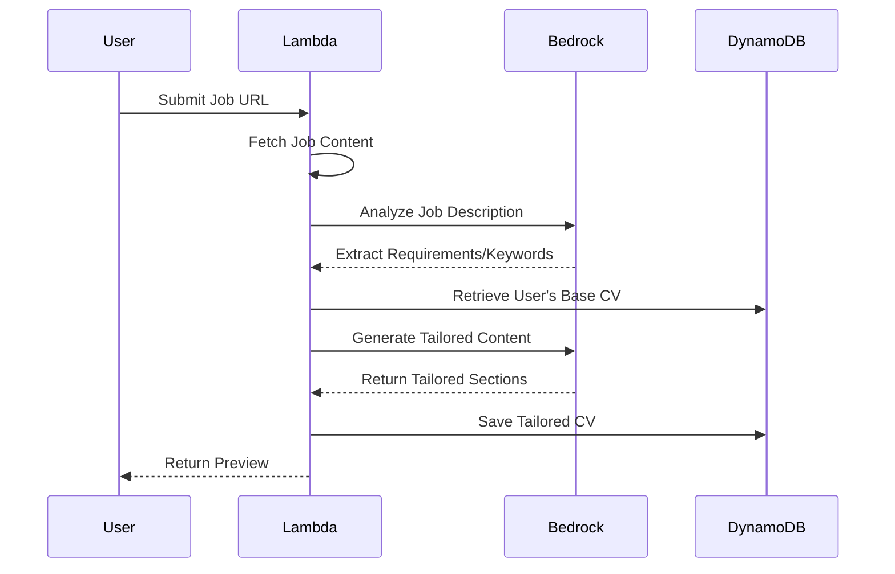

# Design Document

## Overview

ASAP CV is a serverless web application that automatically tailors CVs to match job descriptions with minimal user interaction. The system follows a monorepo architecture with an Angular frontend, Node.js backend running on AWS Lambda, DynamoDB for data persistence, and AWS App Runner for deployment. The application emphasizes simplicity with a streamlined workflow: upload CV → provide job URL → receive tailored CV.

## Architecture

### High-Level Architecture



### System Components

1. **Frontend (Angular)**: Single-page application providing user interface
2. **API Gateway**: RESTful API endpoints for frontend communication
3. **Lambda Functions**: Serverless compute for business logic
4. **DynamoDB**: NoSQL database for user data and CV storage
5. **S3**: File storage for CV documents and generated PDFs
6. **SES**: Email service for email-based CV tailoring
7. **Google OAuth**: Authentication service integration
8. **Amazon Bedrock**: GenAI service for CV content generation and job analysis

## Components and Interfaces

### Frontend Components

#### Core Angular Components
- **AuthComponent**: Handles login/signup with Google OAuth integration
- **DashboardComponent**: Main user interface showing CV versions
- **UploadComponent**: CV file upload functionality
- **JobUrlComponent**: Job description URL input
- **PreviewComponent**: CV preview with highlighted changes
- **ProfileComponent**: User profile management

#### Angular Services
- **AuthService**: Authentication state management and Google OAuth
- **CvService**: CV upload, processing, and version management
- **JobService**: Job URL processing and analysis
- **ApiService**: HTTP client for backend communication

### Backend Lambda Functions

#### Authentication Functions
- **auth-login**: Handle traditional and OAuth login
- **auth-register**: User registration and profile creation
- **auth-refresh**: JWT token refresh

#### CV Processing Functions
- **cv-upload**: Parse and store uploaded CV files
- **cv-process**: Analyze CV content and extract sections using Amazon Bedrock
- **job-fetch**: Fetch job descriptions from URLs using web scraping
- **job-analyze**: Extract requirements and keywords from job descriptions using Amazon Bedrock
- **cv-tailor**: Generate tailored CV content using Amazon Bedrock LLM
- **cv-generate**: Create PDF from tailored content

#### Email Processing Functions
- **email-handler**: Process incoming emails to asapcv@argorand.io
- **email-responder**: Send tailored CVs via email

#### Data Management Functions
- **user-profile**: CRUD operations for user profiles
- **cv-versions**: Manage CV version history

### API Endpoints

```
POST /auth/login
POST /auth/register
POST /auth/refresh
GET  /auth/profile
PUT  /auth/profile

POST /cv/upload
GET  /cv/versions
GET  /cv/versions/{id}
DELETE /cv/versions/{id}

POST /job/analyze        [Rate Limited: 1 req/15s per user]
POST /cv/tailor          [Rate Limited: 1 req/15s per user]
GET  /cv/preview/{id}
POST /cv/download/{id}

POST /email/process (internal)
```

### Rate Limiting Strategy

#### Throttling Implementation
- **DynamoDB Rate Limiting Table**: Track user request timestamps
- **Lambda Middleware**: Validate request timing before processing
- **API Gateway Throttling**: Additional layer for burst protection
- **User Feedback**: Clear messaging about rate limits and wait times

#### Rate Limit Configuration
```typescript
interface RateLimitConfig {
  endpoints: {
    '/job/analyze': {
      limit: 1;
      windowSeconds: 15;
      message: 'Job analysis limited to 1 request per 15 seconds';
    };
    '/cv/tailor': {
      limit: 1;
      windowSeconds: 15;
      message: 'CV tailoring limited to 1 request per 15 seconds';
    };
  };
}
```

## Amazon Bedrock Integration

### GenAI Functionality

The application leverages Amazon Bedrock for AI-powered CV tailoring and job analysis. The integration uses foundation models to understand job requirements and generate tailored CV content.

#### Bedrock Models Used
- **Claude 3 Haiku**: Fast text analysis for job description parsing
- **Claude 3 Sonnet**: Advanced content generation for CV tailoring
- **Titan Text Embeddings**: Semantic matching between CV and job requirements

#### AI Processing Workflow



#### Prompt Engineering Strategy
- **Job Analysis Prompts**: Extract specific requirements, skills, and responsibilities
- **CV Tailoring Prompts**: Generate targeted summaries and bullet points
- **Content Optimization**: Ensure ATS-friendly formatting and keyword density

#### Bedrock Service Configuration
```typescript
interface BedrockConfig {
  region: 'us-east-1';
  models: {
    jobAnalysis: 'anthropic.claude-3-haiku-20240307-v1:0';
    cvTailoring: 'anthropic.claude-3-sonnet-20240229-v1:0';
    embeddings: 'amazon.titan-embed-text-v1';
  };
  maxTokens: 4000;
  temperature: 0.3;
}
```

## Data Models

### User Model
```typescript
interface User {
  userId: string;           // Primary key
  email: string;           // Unique identifier
  fullName: string;
  authProvider: 'local' | 'google';
  googleId?: string;
  passwordHash?: string;   // Only for local auth
  createdAt: Date;
  updatedAt: Date;
  baseCvId?: string;      // Reference to base CV
}
```

### CV Model
```typescript
interface CV {
  cvId: string;           // Primary key
  userId: string;         // Foreign key
  title: string;
  isBase: boolean;
  jobUrl?: string;        // Associated job URL
  content: {
    summary: string;
    experience: ExperienceItem[];
    education: EducationItem[];
    skills: string[];
    contact: ContactInfo;
  };
  s3Key: string;          // PDF file location
  createdAt: Date;
  modifiedSections: string[]; // Sections that were tailored
}
```

### Job Analysis Model
```typescript
interface JobAnalysis {
  jobId: string;          // Primary key
  userId: string;         // Foreign key
  url: string;
  title: string;
  company: string;
  requirements: string[];
  responsibilities: string[];
  keywords: string[];
  extractedContent: string;
  createdAt: Date;
}
```

### Email Request Model
```typescript
interface EmailRequest {
  requestId: string;      // Primary key
  userEmail: string;
  jobUrl: string;
  status: 'processing' | 'completed' | 'failed';
  cvId?: string;          // Generated CV reference
  errorMessage?: string;
  createdAt: Date;
  completedAt?: Date;
}
```

## Error Handling

### Frontend Error Handling
- **Network Errors**: Display user-friendly messages with retry options
- **Validation Errors**: Real-time form validation with clear error messages
- **Authentication Errors**: Redirect to login with appropriate messaging
- **File Upload Errors**: Progress indicators and error recovery

### Backend Error Handling
- **Lambda Error Responses**: Standardized error format with HTTP status codes
- **DynamoDB Errors**: Retry logic with exponential backoff
- **External API Failures**: Graceful degradation and fallback mechanisms
- **Email Processing Errors**: Error responses to sender with troubleshooting

### Error Response Format
```typescript
interface ErrorResponse {
  error: {
    code: string;
    message: string;
    details?: any;
    timestamp: Date;
  };
}
```

## Testing Strategy

### Frontend Testing
- **Unit Tests**: Jest for Angular components and services
- **Integration Tests**: Angular Testing Library for component interactions
- **E2E Tests**: Cypress for complete user workflows
- **Accessibility Tests**: Automated a11y testing with axe-core

### Backend Testing
- **Unit Tests**: Jest for Lambda function logic
- **Integration Tests**: AWS SDK mocking for DynamoDB operations
- **API Tests**: Supertest for endpoint testing
- **Load Tests**: Artillery for performance validation

### Test Coverage Requirements
- Minimum 80% code coverage for critical paths
- 100% coverage for authentication and security functions
- Performance tests for CV processing under load
- Email processing workflow validation

### Security Testing
- **Authentication Flow Testing**: OAuth and traditional login security
- **Authorization Testing**: User data isolation verification
- **Input Validation Testing**: Malicious input handling
- **File Upload Security**: Virus scanning and file type validation

### Deployment Testing
- **Infrastructure as Code**: CloudFormation template validation
- **Blue-Green Deployment**: Zero-downtime deployment testing
- **Rollback Procedures**: Automated rollback capability testing
- **Monitoring Integration**: CloudWatch alerts and logging validation