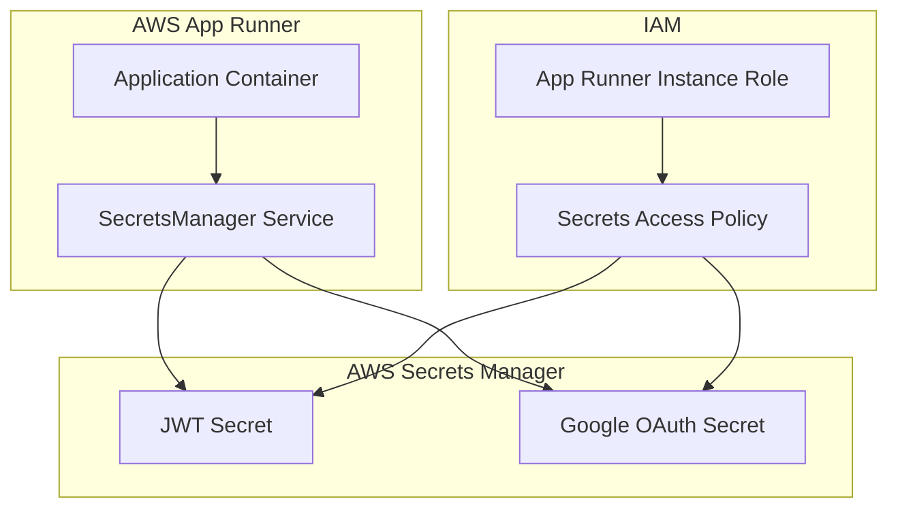

# Secrets Management Guide

This guide explains how to securely configure Google OAuth and other sensitive environment variables using AWS Secrets Manager for the ASAP CV application.

## Overview

The application uses AWS Secrets Manager to securely store and retrieve sensitive configuration values like JWT secrets and Google OAuth credentials. This approach provides:

- **Security**: Secrets are encrypted at rest and in transit
- **Rotation**: Automatic secret rotation capabilities
- **Audit**: Full audit trail of secret access
- **Separation**: Secrets are separated from application code
- **Environment Isolation**: Different secrets for dev/staging/prod

## Architecture



## Setup Instructions

### 1. Deploy Infrastructure

First, deploy the Terraform infrastructure with Google OAuth enabled:

```bash
# Navigate to terraform directory
cd terraform

# Set Google OAuth to enabled
echo 'enable_google_oauth = true' >> terraform.tfvars

# Deploy infrastructure
terraform plan
terraform apply
```

### 2. Configure JWT Secret

After deployment, update the JWT secret in AWS Secrets Manager:

```bash
# Get the secret ARN from Terraform output
SECRET_ARN=$(terraform output -raw jwt_secret_arn)

# Update the JWT secret with a strong random value
aws secretsmanager update-secret \
  --secret-id "$SECRET_ARN" \
  --secret-string '{"JWT_SECRET":"'$(openssl rand -base64 64)'"}'
```

### 3. Configure Google OAuth Credentials

#### Step 3.1: Create Google OAuth Application

1. Go to [Google Cloud Console](https://console.cloud.google.com/)
2. Create a new project or select existing project
3. Enable the Google+ API
4. Go to "Credentials" → "Create Credentials" → "OAuth 2.0 Client IDs"
5. Configure the OAuth consent screen
6. Set application type to "Web application"
7. Add authorized redirect URIs:
   - For development: `http://localhost:3000/api/auth/google/callback`
   - For production: `https://your-domain.com/api/auth/google/callback`

#### Step 3.2: Store Google OAuth Credentials

```bash
# Get the Google OAuth secret ARN
GOOGLE_SECRET_ARN=$(terraform output -raw google_oauth_secret_arn)

# Update with your Google OAuth credentials
aws secretsmanager update-secret \
  --secret-id "$GOOGLE_SECRET_ARN" \
  --secret-string '{
    "GOOGLE_CLIENT_ID":"your-google-client-id.googleusercontent.com",
    "GOOGLE_CLIENT_SECRET":"your-google-client-secret"
  }'
```

### 4. Verify Configuration

Check that secrets are properly configured:

```bash
# Test JWT secret
aws secretsmanager get-secret-value --secret-id "$SECRET_ARN" --query SecretString --output text

# Test Google OAuth secret
aws secretsmanager get-secret-value --secret-id "$GOOGLE_SECRET_ARN" --query SecretString --output text
```

## Environment Variables

The application expects these environment variables to be set by App Runner:

### Required Variables
- `JWT_SECRET`: ARN of the JWT secret in Secrets Manager
- `AWS_REGION`: AWS region where secrets are stored
- `NODE_ENV`: Application environment (development/staging/production)

### Optional Variables (for Google OAuth)
- `GOOGLE_CLIENT_ID`: ARN of Google OAuth secret (for client ID)
- `GOOGLE_CLIENT_SECRET`: ARN of Google OAuth secret (for client secret)

## Application Behavior

### Startup Sequence

1. **Application Start**: Container starts and begins initialization
2. **Secrets Loading**: SecretsManager service loads all secrets from AWS
3. **Health Checks**: Application verifies all required secrets are available
4. **Service Ready**: Application begins accepting requests

### Runtime Behavior

- **Caching**: Secrets are cached for 5 minutes to reduce API calls
- **Lazy Loading**: Google OAuth credentials are loaded only when needed
- **Error Handling**: Missing secrets result in graceful degradation
- **Health Monitoring**: `/health` endpoint reports initialization status

### Security Features

- **Least Privilege**: IAM roles grant minimal required permissions
- **Encryption**: All secrets encrypted at rest and in transit
- **Audit Trail**: All secret access is logged in CloudTrail
- **No Hardcoding**: No secrets stored in code or environment variables

## Monitoring and Troubleshooting

### Health Check Endpoint

```bash
curl https://your-app-url.com/health
```

Response when healthy:
```json
{
  "status": "healthy",
  "timestamp": "2024-01-15T10:30:00.000Z",
  "uptime": 3600,
  "environment": "production",
  "initialized": true
}
```

### Common Issues

#### 1. Secrets Not Found
**Error**: `Failed to retrieve secret: The request failed because the specified secret doesn't exist`

**Solution**: Verify secret ARNs in Terraform outputs and ensure secrets exist in AWS Secrets Manager.

#### 2. Permission Denied
**Error**: `AccessDenied: User is not authorized to perform: secretsmanager:GetSecretValue`

**Solution**: Check IAM role permissions and ensure App Runner instance role has access to secrets.

#### 3. Google OAuth Not Working
**Error**: `Google OAuth is not configured`

**Solution**: 
1. Verify `enable_google_oauth = true` in Terraform
2. Check Google OAuth credentials are properly stored in Secrets Manager
3. Ensure redirect URIs match in Google Console and application

#### 4. Application Won't Start
**Error**: `Application initialization failed`

**Solution**:
1. Check App Runner logs for specific error messages
2. Verify all required environment variables are set
3. Test secret access manually using AWS CLI

### Logs and Debugging

App Runner logs show the initialization process:

```
🚀 Starting ASAP CV application initialization...
Initializing secrets from AWS Secrets Manager...
✓ JWT secret loaded
✓ Google OAuth credentials loaded
🔍 Performing health checks...
✓ Secrets Manager is healthy
✓ Environment variables are configured
✅ All health checks passed
✅ Application initialization completed successfully
```

## Security Best Practices

### 1. Secret Rotation
Set up automatic rotation for sensitive secrets:

```bash
aws secretsmanager rotate-secret \
  --secret-id "$SECRET_ARN" \
  --rotation-rules AutomaticallyAfterDays=90
```

### 2. Access Monitoring
Monitor secret access using CloudTrail:

```bash
aws logs filter-log-events \
  --log-group-name CloudTrail \
  --filter-pattern "{ $.eventName = GetSecretValue }"
```

### 3. Environment Separation
Use different secrets for each environment:

- `asap-cv-dev-jwt-secret`
- `asap-cv-staging-jwt-secret`
- `asap-cv-prod-jwt-secret`

### 4. Backup and Recovery
Enable cross-region replication for critical secrets:

```bash
aws secretsmanager replicate-secret-to-regions \
  --secret-id "$SECRET_ARN" \
  --add-replica-regions Region=us-west-2
```

## Development Setup

For local development, you can use AWS credentials to access secrets:

```bash
# Set AWS credentials
export AWS_ACCESS_KEY_ID=your-access-key
export AWS_SECRET_ACCESS_KEY=your-secret-key
export AWS_REGION=us-east-1

# Set secret ARNs (get from Terraform output)
export JWT_SECRET=arn:aws:secretsmanager:us-east-1:123456789:secret:asap-cv-dev-jwt-secret-AbCdEf
export GOOGLE_CLIENT_ID=arn:aws:secretsmanager:us-east-1:123456789:secret:asap-cv-dev-google-oauth-XyZ123:GOOGLE_CLIENT_ID::
export GOOGLE_CLIENT_SECRET=arn:aws:secretsmanager:us-east-1:123456789:secret:asap-cv-dev-google-oauth-XyZ123:GOOGLE_CLIENT_SECRET::

# Start development server
npm run dev
```

## Testing

Test the secrets management system:

```bash
# Run backend tests
cd backend
npm test

# Test specific secrets functionality
npm test -- --grep "secrets"

# Integration test with real AWS secrets (requires AWS credentials)
npm run test:integration
```

## Conclusion

This secrets management implementation provides a secure, scalable, and maintainable approach to handling sensitive configuration in the ASAP CV application. The system automatically loads secrets at startup, caches them for performance, and provides comprehensive error handling and monitoring capabilities.